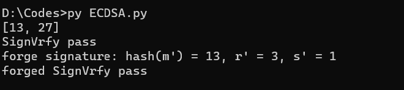

# Bitcoin

## Project: forge a signature to pretend that you are Satoshi.

该项目实现了ECDSA签名和验证，并且实现了签名的伪造，其中签名的伪造只能得到某个特定hash值的签名，但是无法直接得到消息的签名值，随机选择$u,v$，计算$R'=(x',y')=uG+vP, r' = x' \pmod{n}$，为了通过验证，需要$s'^{-1}(e'G+r'P) = uG + vP$，令$e'=r'uv^{-1}\pmod{n},s'=r'v^{-1}\pmod{n}$，那么得到的$(r',s')$即为哈希值$e'$用未知的私钥$d$签的签名。

某次运行结果如下：


### 代码说明

`ECCADD`函数和`ECCMUL`函数分别实现了椭圆曲线加法群上的加法和点乘运算。

```python
def ECCADD(P, Q):
    if (P[0] == 0) and (P[1] == 0):
        return Q
    if (Q[0] == 0) and (Q[1] == 0):
        return P
    if (P == Q):
        lambd = ((3 * (P[0] ** 2) + a ) * inverse(2 * P[1], p)) % p
    else:
        if gcd(Q[0] - P[0], p) != 1 and gcd(Q[0] - P[0], p) != -1:
            return [0, 0]
        else:
            lambd = ((Q[1] - P[1]) * inverse(Q[0] - P[0], p)) % p
    x = (lambd ** 2 - P[0] - Q[0]) % p
    y = (lambd * (P[0] - x) - P[1]) % p
    return [x,y]

def ECCMUL(k, Q):
    if k == 0:
        return [0,0]
    if k == 1:
        return Q
    if k >= 2:
        temp = Q
        while(1):
            temp = ECCADD(temp, Q)
            k = k - 1
            if k == 1:
                return temp
```

`ECDSASign`函数实现了ECDSA签名算法的签名部分，`ECDSAVrfy`函数实现了ECDSA签名算法的验证部分。

```python
def ECDSASign(d, e, n, G):  #e = hash(m)
    while 1:
        k = random.randint(1, n)
        if gcd(k, n) == 1:
            break
    R = ECCMUL(k, G)
    r = R[0] % n
    s = (((inverse(k, n)+n)%n) * (e + d * r)) % n
    return [r, s]
def ECDSAVrfy(P, e, n, G, r, s):  #e = hash(m)
    w = (inverse(s, n) + n) % n
    t1 = (e * w) % n
    t2 = (r * w) % n
    X = ECCADD(ECCMUL(t1, G), ECCMUL(t2, P))
    r_ = X[0]
    if r == r_:
        return 1
    else:
        return 0
```

`pretend`函数实现了对某个hash值的签名伪造。

```
def pretend(G, P, n):
    u = random.randint(1, n)
    v = random.randint(1, n)
    R = ECCADD(ECCMUL(u, G), ECCMUL(v, P))
    r = R[0] % n
    e = (r * u * inverse(v, n)) % n
    s = (r * inverse(v, n)) % n
    return e, r, s
```
