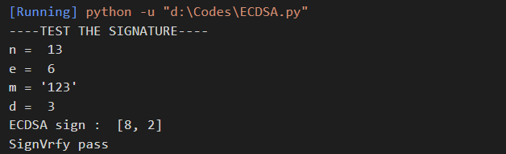
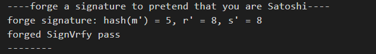

# Bitcoin

项目完成人：郭灿林

|文件名|项目|
|-|-|
|BitcoinTX.md|Project: send a tx on Bitcoin testnet, and parse the tx data down to every bit, better write script yourself|
|ECDSA.py|Project: forge a signature to pretend that you are Satoshi|

运行指导：
需要安装以下库，并且需要python运行环境。

```
pip install numpy
pip install Crypto
pip install hashlib
```

## Bitcoin TX 分析

file :BitcoinTX.md

Project : send a tx on Bitcoin testnet, and parse the tx data down to every bit, better write script yourself

具体报告见`BitcoinTX.md`文件。

## ECDSA签名伪造

file : ECDSA.py

Project : forge a signature to pretend that you are Satoshi.

该项目实现了ECDSA签名和验证，并且实现了签名的伪造，其中签名的伪造只能得到某个特定hash值的签名，但是无法直接得到消息的签名值，随机选择$u,v$，计算$R'=(x',y')=uG+vP, r' = x' \pmod{n}$，为了通过验证，需要$s'^{-1}(e'G+r'P) = uG + vP$，令$e'=r'uv^{-1}\pmod{n},s'=r'v^{-1}\pmod{n}$，那么得到的$(r',s')$即为哈希值$e'$用未知的私钥$d$签的签名。

某次运行结果如下：

签名验证：



伪造成功：



### 代码说明

`add`函数和`mult`函数分别实现了椭圆曲线加法群上的加法和点乘运算。两个函数参考了组员李岱耕的SM2实现部分。

```python
def add(P, Q):
        if not P:
            return Q
        if not Q:
            return P
        if P[0] == Q[0]:
            if (P[1] + Q[1]) % p == 0:
                return
            lmd = (3 * P[0] * Q[0] + a) * \
                pow(int(P[1] + Q[1]), p - 2, p) % p
        else:
            lmd = (Q[1] - P[1]) * pow(int(Q[0] - P[0]), p - 2, p) % p
        x = (lmd * lmd - P[0] - Q[0]) % p
        y = (lmd * (P[0] - x) - P[1]) % p
        return x, y

def mult(n, P):
        if n == 0:
            return
        Q = mult(n >> 1, P)
        return add(add(Q, Q), P) if n & 1 else add(Q, Q)
```

`ECDSASign`函数实现了ECDSA签名算法的签名部分，`ECDSAVrfy`函数实现了ECDSA签名算法的验证部分。

```python
def ECDSASign(d, e, n, G):  #e = hash(m)
    while 1:
        k = random.randint(1, n)
        R = mult(k, G)
        r = R[0] % n
        s = (inverse(k, n) * (e + d * r)) % n
        if s == 0 or r == 0:
            continue
        else:
            break
    return [r, s]
def ECDSAVrfy(P, e, n, G, r, s):  #e = hash(m)
    w = inverse(s, n) % n
    t1 = (e * w) % n
    t2 = (r * w) % n
    X = add(mult(t1, G), mult(t2, P))
    if X == None:
        print("the sig invalid")
        return
    else:
        r_ = X[0] % n
    if r == r_:
        return 1
    else:
        return 0
```

`pretend`函数实现了对某个hash值的签名伪造。

```
def pretend(G, P, n):
    u = random.randint(1, n)
    v = random.randint(1, n)
    R = ECCADD(ECCMUL(u, G), ECCMUL(v, P))
    if R == 0:
        r = 0
    else:
        r = R[0] % n
    e = (r * u * inverse(v, n)) % n
    s = (r * inverse(v, n)) % n
    return e, r, s
```
