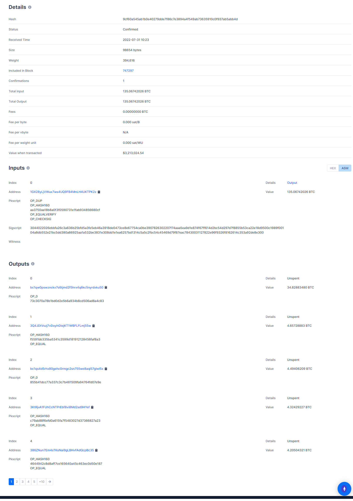

# Bitcoin TX 分析

参考以下网址的一笔比特币交易，进行分析：

`https://www.blockchain.com/btc/tx/9cf60a545ab1b0e40279dde7f86c7e3894a4f549ab73635910c0f937ab5abb4d`

如图



* `Hash` 表示整个 transaction 的哈希值
* `Status` 表示该 transaction 已经生成区块
* `Received Time` 表示该 transaction 被接收的时间
* `Size` 表示该 transaction 的总大小，单位为 bytes
* `Weight` 表示该交易的权重，根据区块大小限制，将不同交易的大小进行相互比较的度量
* `Included in Block` 表示有几个区块包括了这个 transaction
* `Confirmations` 表示成功将该 transaction 添加到区块链上
* `Total Input` 表示转入的 bitcoin 数量
* `Total Output` 表示转出的 bitcoin 数量
* `Fees` 表示做这个 transaction 需要交的手续费
* `Fee per byte` 表示每 byte 的花费
* `Fee per vbyte`
* `Fee per weight unit`
* `Value when transacted` 表示交易时每个 bitcoin 价值多少美元

## Inputs

* `Index` 表示 `input` 的索引，`Inputs` 只能有一个。
* `Address`表示该 transaction 转入 bitcoin 的账户的地址，比如这里是 `1GX28yLjVWux7ws4UQ9FB4MnLH4UKTPK2z`
* `Pkscript` 表示验证签名的 script，这里十六进制显示为 `76a914aa3750aa18b8a0f3f0590731e1fab934856680cf88ac`，对应的脚本语言如下

```none
OP_DUP
OP_HASH160
aa3750aa18b8a0f3f0590731e1fab934856680cf
OP_EQUALVERIFY
OP_CHECKSIG
```

* `Sigscript` 表示支付 bitcoin 的用户的签名
* `Witness`

## Outputs

* `Index` 表示 `output` 的索引，`output` 可以有多个
* `Address` 表示 bitcoin 转入账户的地址
* `Value` 表示转入该账户的bitcoin，`Inputs` 表示的是转入的总额，所有 `output` 的 `Value` 加起来要等于 `Inputs` 的 `Value` 总额。
* `Pkscript`
