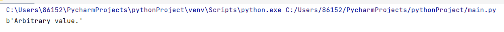
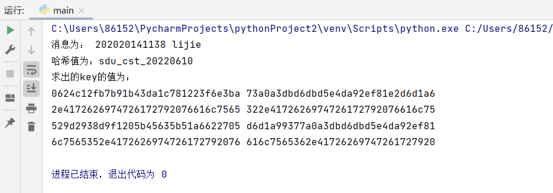
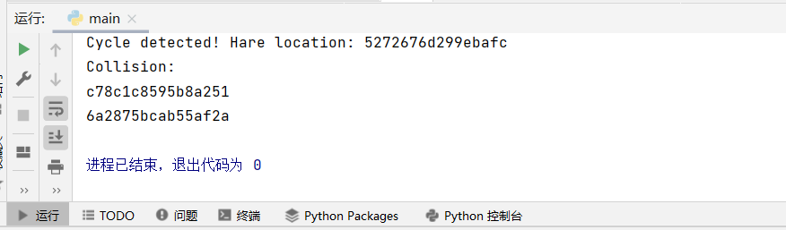

# Real world cryptanalyses

贡献者：李婕

目录：

- [Encrypt](#Encrypt)

- [Invertibility](#Invertibility)

- [Symmetry](#Symmetry)

代码参考链接：https://peter.website/meow-hash-cryptanalysis

## Encrypt

### 明文与密钥如下：

```python3
meow_default_seed = bytes.fromhex(
    "17180fbeaaaf6095c0b5ebd24f9e9fe9a7aac518ff05b230d29b74137467bc4a"
    "a611dfaf465a50c44b0dbf171f6c8242242800c887d20830ff2f96340099f735"
    "8590e7f8db60479d6c92cecad24deeef16d19e9ef67a680782dedbf2766587ba"
    "f1d9572b0117e02d13c23eadc14a0c1f27a4d6fa9fdb5067241d2488c99beff9"
)

meow_default_m = bytes(
    ("Arbitrary example input: Lorem ipsum dolor sit amet, consectetur adipiscing elit, sed"
    " do eiusmod tempor incididunt ut labore et dolore magna aliqua. Ut enim ad minim veniam,"
    " quis nostrud exercitation ullamco laboris nisi ut aliquip ex ea commodo consequat."),encoding='utf-8'
)
```

### 根据上文链接测试加密结果如下：



## Invertibility

Mewo hash 中所有部件均为可逆，且使用 1024 位密钥作为 1024 位初始状态，因此给定一个消息和目标哈希值，可以计算一个密钥。
只需将哈希函数的所有步骤从输出状态一直向后运行到初始状态。

### 算法说明

### squeeze_inverse函数如下：

该函数较为简单，只需按照正常步骤倒转即可，注意最后的通道变化。

```python3
    paddq(lanes[0], lanes[4])
    pxor(lanes[4], lanes[5])
    pxor(lanes[0], lanes[1])
    paddq(lanes[5], lanes[7])
    paddq(lanes[1], lanes[3])
    paddq(lanes[4], lanes[6])
    paddq(lanes[0], lanes[2])
```

### Finalization_inverse函数如下：

```python3
    pxor(lanes[0], lanes[1])
    paddq(lanes[4], lanes[5])
    aes_enc(lanes[3], lanes[0])
    pxor(lanes[3], lanes[5])
    paddq(lanes[0], lanes[4])
    pxor(lanes[3], lanes[5])
    aes_enc(lanes[7], lanes[3])
```

### 明文吸收函数如下：
 
该部分较为复杂，输入的明文 m 长度是不可知的，因此将明文扩展成哈希所需的长度。
 
将明文长度填充到 32 字节的倍数；若已经是一个倍数，则添加一个完整的零块
   
```python3
    original_length = len(input_bytes)
    target_length = ((len(input_bytes) // 32) + 1) * 32
    input_bytes += b"\0" * (target_length - original_length)
```

剪掉最后一块

```python3
    input_bytes, tail_block = input_bytes[:-32], input_bytes[-32:]
```

吸收所有 256 字节块

```python3
    off = 0
    while off + 256 <= len(input_bytes):
        for _ in range(8):
            meow_mix(0, input_bytes[off: off + 32])
            off += 32

    meow_mix_funky(0, tail_block)
    message_length_block = struct.pack("<QQQQ", 0, 0, original_length, 0)
    meow_mix_funky(1, message_length_block)

    while off + 32 <= len(input_bytes):
        meow_mix(2 + off // 32, input_bytes[off: off + 32])
        off += 32
```

### AES 加密函数
 
正常哈希使用的是 AES 解密函数，获取密钥时应使用加密。

```python3
def aes_enc(password: bytearray, text: bytearray):
    iv = b'1234567812345678'
    aes = AES.new(password, AES.MODE_CBC, iv)
    en_text = aes.encrypt(text)
```

### 测试结果



## Symmetry

### 对称性内容说明

128 位值的高阶和低阶 64 位半部分相等，则将其称为对称值。Meow hash 的三个操作：

在 128 位通道上应用一轮 AES 解密。
将 128 位值 Xor 转换为 128 位通道。
通过按元素添加低和高 64 位字，将 128 位值添加到 128 位通道中。

均具有对称性。巧妙利用「零长度消息」则可满足对称性。

### 密钥如下：

```cpp
uint64_t f(uint64_t x) {
    uint64_t symmetrize32[16] = {
        3224358602161482154llu, 1814594138510994814llu, 13954951486077169833llu, 12219675304746119337llu,
        32, 0, 0, 0,
        15245537510594700387llu, 11375056618140292268llu, 15015954861103735561llu, 7161769469951828835llu,
        0, 0, 0, 0
    };
    uint64_t message[4] = { x, x, x, x };
    meow_u128 h = MeowHash(symmetrize32, 32, message);
    return *(uint64_t*)&h;
}
```

### 运行结果



