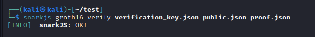

# Real world zk

项目完成人：郭灿林

folder : circom

Project : Write a circuit to prove that your CET6 grade is larger than 425

参考文章：https://feeler.blog.csdn.net/article/details/124145767

(注：该项目完成核心思路和步骤来自上述文章。)

## 运行指导

### 安装Node

```
sudo apt update
sudo apt install nodejs npm -y
node --version
```

### 安装Rust

```
sudo apt install curl -y
sudo apt install cmake build-essential -y
curl --proto '=https' --tlsv1.2 https://sh.rustup.rs -sSf | sh
```

### 安装Circom

```
git clone https://github.com/iden3/circom.git
cd circom
source $HOME/.cargo/env
cargo build --release
```

### 更新Circom

```
cargo install --path circom
circom --help
```

### 安装Snarkjs

```
sudo npm install -g snarkjs
```

### 编译电路

在文件夹`circom`中执行运行命令

```
circom InRange.circom --r1cs --wasm --sym
```

### 计算获得证据

```
cd InRange_js
node generate_witness.js InRange.wasm ../input.json ../witness.wtns
```

### 证明电路

```
snarkjs powersoftau new bn128 12 pot12_0000.ptau -v
snarkjs powersoftau contribute pot12_0000.ptau pot12_0001.ptau --name="First contribution" -v
snarkjs powersoftau prepare phase2 pot12_0001.ptau pot12_final.ptau -v
snarkjs groth16 setup InRange.r1cs pot12_final.ptau multiplier2_0000.zkey
snarkjs zkey contribute multiplier2_0000.zkey multiplier2_0001.zkey --name="1st Contributor Name" -v
snarkjs zkey export verificationkey multiplier2_0001.zkey verification_key.json
snarkjs groth16 prove multiplier2_0001.zkey witness.wtns proof.json public.json
snarkjs groth16 verify verification_key.json public.json proof.json
```

## 结果

如图，显示OK，说明证明成功，即四级成绩在及格范围内。



### 代码说明

该项目的实现主要是用了封装好的黑箱，自己写的代码只有`InRange.circom`和`input.json`，在`InRange.circom`中，主要修改了`Main()`，其他代码来自上述参考文章，代码见下。`pass`为及格的范围，`mygrade`为需要隐藏的成绩，`out`输出结果1或0，`GreaterEqThan(10)`参数为`10`表示输入的数字的大小至多为10 bits，即最大为$2 ^ {10} = 1024$，只要`mygrade`大于等于`pass[0]`，`out`就输出`1`。

```
template Main() {
    signal input pass[2];
 
    signal input mygrade;
 
    signal output out;
 
    component gt1 = GreaterEqThan(10);
    gt1.in[0] <== mygrade;
    gt1.in[1] <== pass[0];
    gt1.out === 1;
}
```

`input.json`文件为输入的参数，代码如下，对应到上面电路文件的参数。

```
{
    "pass": [ 425, 710],
    "mygrade": 520
}
```
