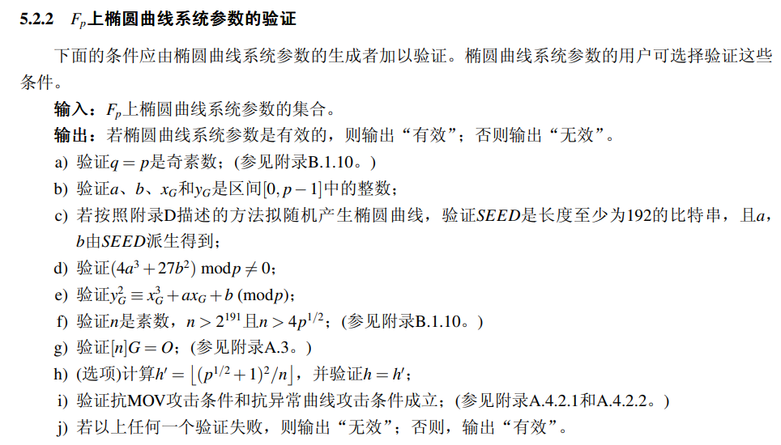
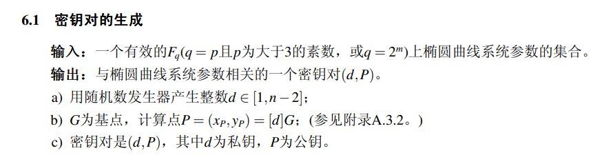
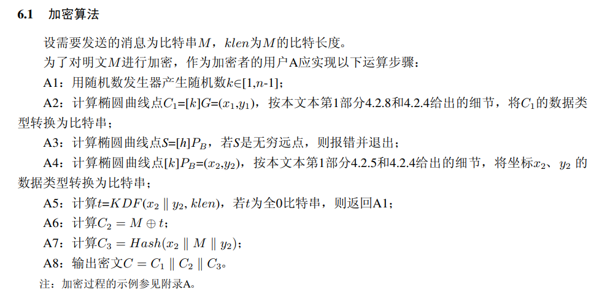
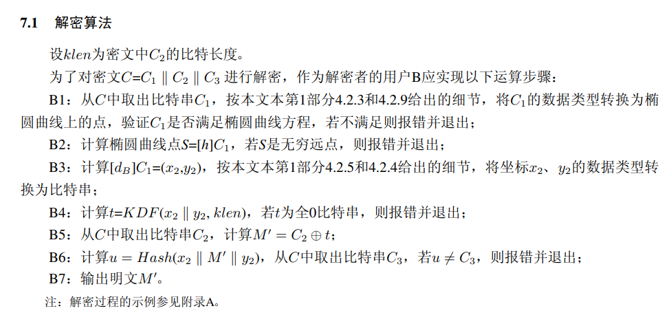
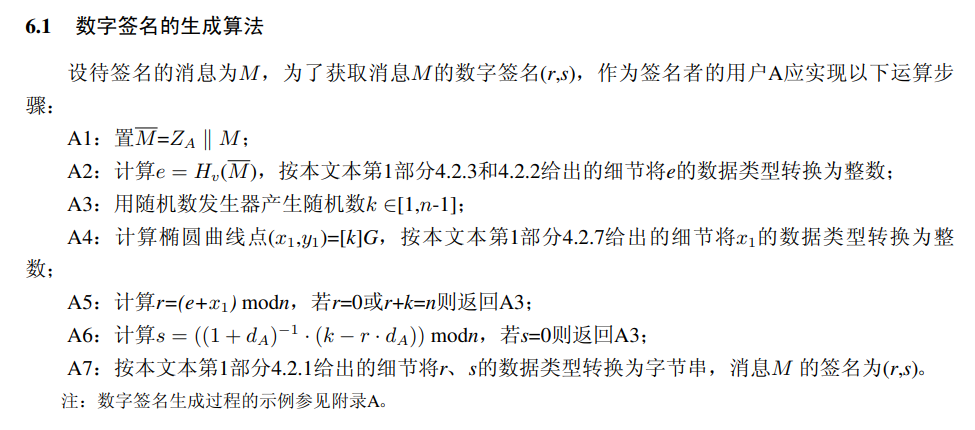
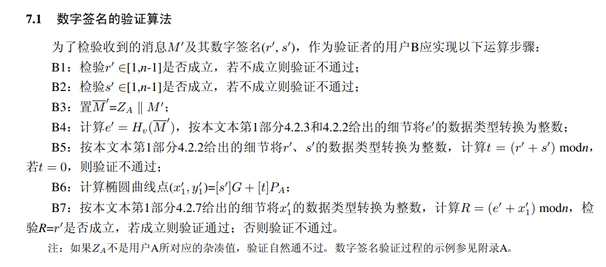
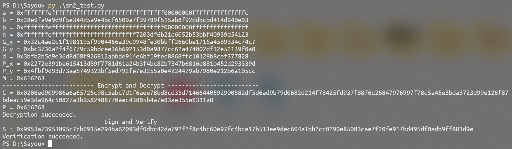
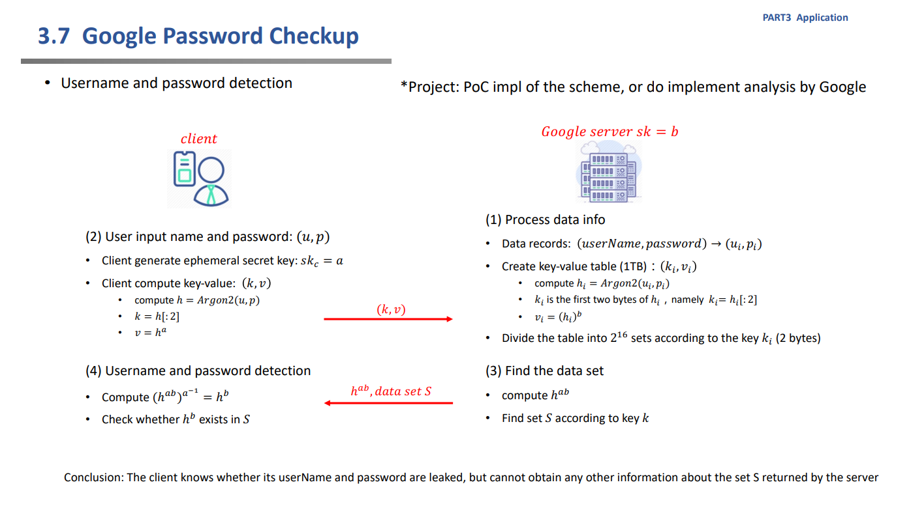
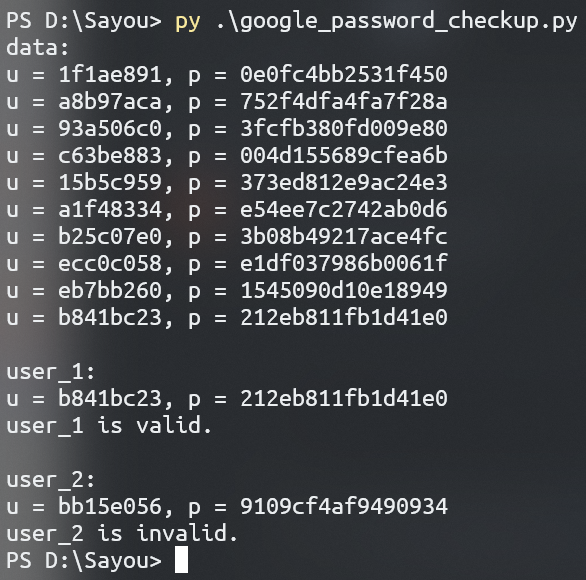

# SM2

贡献者：李岱耕

目录：

- [SM2 with RFC6979](#sm2-with-rfc6979)

- [Google Password Checkup](#google-password-checkup)

## SM2 with RFC6979

### 说明

实现了 SM2 最基本的加解密、签名和验证功能。其中，签名实现了对 RFC 6979 的支持。

### 具体实现

创建 SM3 类，并实现椭圆曲线的基本运算：

```python3
class SM2:
    def check(self, P):
        return not P or (P[0] * P[0] * P[0] - P[1] * P[1] + self.a * P[0] + self.b) % self.p == 0

    def add(self, P, Q):
        if not P:
            return Q
        if not Q:
            return P
        if P[0] == Q[0]:
            if (P[1] + Q[1]) % self.p == 0:
                return
            lmd = (3 * P[0] * Q[0] + self.a) * \
                pow(P[1] + Q[1], self.p - 2, self.p) % self.p
        else:
            lmd = (Q[1] - P[1]) * pow(Q[0] - P[0], self.p - 2, self.p) % self.p
        x = (lmd * lmd - P[0] - Q[0]) % self.p
        y = (lmd * (P[0] - x) - P[1]) % self.p
        return x, y

    def mult(self, n, P):
        if n == 0:
            return
        Q = self.mult(n >> 1, P)
        return self.add(self.add(Q, Q), P) if n & 1 else self.add(Q, Q)
```

#### 参数验证和密钥对生成





代码实现：

```python3
    def __init__(self, m, a, b, p, n, G):
        self.m = m
        assert isprime(p) and 2 < p < 256 ** m and \
            (4 * a * a * a + 27 * b * b) % p != 0
        self.a = a % p
        self.b = b % p
        self.p = p
        assert isprime(n) and n > 2 ** 191 and n * n > 16 * p and \
            self.check(G) and not self.mult(n, G)
        self.n = n % p
        self.G = G[0] % p, G[1] % p
        self.d = random.randrange(1, n - 1)
        self.P = self.mult(self.d, G)
```

#### 加密



代码实现：

```python3
    def encrypt(self, M):
        klen = len(M)
        t = bytes(klen)
        while not any(t):
            k = random.randrange(1, self.n)
            kP = self.mult(k, self.P)
            x2, y2 = kP[0].to_bytes(self.m, 'big'), kP[1].to_bytes(self.m, 'big')
            t = kdf(x2 + y2, klen)
        kG = self.mult(k, self.G)
        x1, y1 = kG[0].to_bytes(self.m, 'big'), kG[1].to_bytes(self.m, 'big')
        C1 = x1 + y1
        C2 = bytes(a ^ b for a, b in zip(M, t))
        C3 = pysmx.SM3.digest(x2 + M + y2)
        return C1 + C2 + C3
```

#### 解密



代码实现：

```python3
    def decrypt(self, C):
        l2 = 2 * self.m
        C1 = C[:l2]
        C2 = C[l2:-32]
        C3 = C[-32:]
        klen = len(C2)
        x1, y1 = C1[:self.m], C1[self.m:]
        kG = int.from_bytes(x1, 'big'), int.from_bytes(y1, 'big')
        assert self.check(kG)
        kP = self.mult(self.d, kG)
        x2, y2 = kP[0].to_bytes(self.m, 'big'), kP[1].to_bytes(self.m, 'big')
        t = kdf(x2 + y2, klen)
        assert any(t)
        M = bytes(a ^ b for a, b in zip(C2, t))
        assert pysmx.SM3.digest(x2 + M + y2) == C3
        return M
```

#### 签名



代码实现：

```python3
    def sign(self, E, rfc6979=False):
        e = int.from_bytes(E, 'big')
        r = 0
        while r == 0 or r + k == self.n or s == 0:
            k = self.deterministic_generate_k(E) if rfc6979 else random.randrange(1, self.n)
            x = self.mult(k, self.G)[0]
            r = (e + x) % self.n
            s = pow(self.d + 1, self.n - 2, self.n) * (k - r * self.d) % self.n
        return r.to_bytes(self.m, 'big') + s.to_bytes(self.m, 'big')
```

#### 验证



代码实现：

```python3
    def verify(self, S, E):
        r = int.from_bytes(S[:self.m], 'big')
        s = int.from_bytes(S[self.m:], 'big')
        if not (0 < r < self.n and 0 < s < self.n):
            return False
        e = int.from_bytes(E, 'big')
        t = (r + s) % self.n
        if t == 0:
            return False
        x = self.add(self.mult(s, self.G), self.mult(t, self.P))[0]
        R = (e + x) % self.n
        return r == R
```

#### RFC 6979

RFC 6979 官方文档对 k 生成方式的描述如下：

```
3.2.  Generation of k

   Given the input message m, the following process is applied:

   a.  Process m through the hash function H, yielding:

          h1 = H(m)

       (h1 is a sequence of hlen bits).

   b.  Set:

          V = 0x01 0x01 0x01 ... 0x01

       such that the length of V, in bits, is equal to 8*ceil(hlen/8).
       For instance, on an octet-based system, if H is SHA-256, then V
       is set to a sequence of 32 octets of value 1.  Note that in this
       step and all subsequent steps, we use the same H function as the
       one used in step 'a' to process the input message; this choice
       will be discussed in more detail in Section 3.6.

   c.  Set:

          K = 0x00 0x00 0x00 ... 0x00

       such that the length of K, in bits, is equal to 8*ceil(hlen/8).

   d.  Set:

          K = HMAC_K(V || 0x00 || int2octets(x) || bits2octets(h1))

       where '||' denotes concatenation.  In other words, we compute
       HMAC with key K, over the concatenation of the following, in
       order: the current value of V, a sequence of eight bits of value
       0, the encoding of the (EC)DSA private key x, and the hashed
       message (possibly truncated and extended as specified by the
       bits2octets transform).  The HMAC result is the new value of K.
       Note that the private key x is in the [1, q-1] range, hence a
       proper input for int2octets, yielding rlen bits of output, i.e.,
       an integral number of octets (rlen is a multiple of 8).

   e.  Set:

          V = HMAC_K(V)

   f.  Set:

          K = HMAC_K(V || 0x01 || int2octets(x) || bits2octets(h1))

       Note that the "internal octet" is 0x01 this time.

   g.  Set:

          V = HMAC_K(V)

   h.  Apply the following algorithm until a proper value is found for
       k:

       1.  Set T to the empty sequence.  The length of T (in bits) is
           denoted tlen; thus, at that point, tlen = 0.

       2.  While tlen < qlen, do the following:

              V = HMAC_K(V)

              T = T || V

       3.  Compute:

              k = bits2int(T)

           If that value of k is within the [1,q-1] range, and is
           suitable for DSA or ECDSA (i.e., it results in an r value
           that is not 0; see Section 3.4), then the generation of k is
           finished.  The obtained value of k is used in DSA or ECDSA.
           Otherwise, compute:

              K = HMAC_K(V || 0x00)

              V = HMAC_K(V)

           and loop (try to generate a new T, and so on).

   Please note that when k is generated from T, the result of bits2int
   is compared to q, not reduced modulo q.  If the value is not between
   1 and q-1, the process loops.  Performing a simple modular reduction
   would induce biases that would be detrimental to signature security.
```

代码实现如下：

```python3
    def deterministic_generate_k(self, M):
        V = bytes(1 for _ in range(32))
        K = bytes(0 for _ in range(32))
        K = hmac.new(K, V + b'\x00' + self.d.to_bytes(self.m, 'big') + M, pysmx.SM3.SM3).digest()
        V = hmac.new(K, V, pysmx.SM3.SM3).digest()
        K = hmac.new(K, V + b'\x01' + self.d.to_bytes(self.m, 'big') + M, pysmx.SM3.SM3).digest()
        V = hmac.new(K, V, pysmx.SM3.SM3).digest()
        while True:
            T = bytes()
            while len(T) < self.m:
                V = hmac.new(K, V, pysmx.SM3.SM3).digest()
                T += V
            k = int.from_bytes(T, 'big')
            if 0 < k < self.n:
                return k
            K = hmac.new(K, V + b'\x00', pysmx.SM3.SM3).digest()
            V = hmac.new(K, V, pysmx.SM3.SM3).digest()
```

### 运行指导

运行前需要先安装 python 第三方库 snowland-smx，可通过以下命令安装：

```
pip install snowland-smx==0.3.2a1
```

安装完成后，在当前文件目录执行以下命令以运行测试程序：

```
python3 ./sm2_test.py
```

### 运行结果



## Google Password Checkup

### 具体实现



创建 `GPCServer` 和 `GPCClient` 类分别表示 Google Password Checkup 的服务器和客户端，服务端在初始化函数中处理原始数据并生成私钥 $b$，代码如下：

```python3
    def __init__(self, data, p):
        assert isprime(p)
        self.p = p
        self.b = random.randrange(1, self.p)
        self.table = {i.to_bytes(2, 'big'): set() for i in range(0xffff)}
        for up in data.items():
            h = hash(up) % self.p
            k = h.to_bytes(8, 'big')[:2]
            v = pow(h, self.b, self.p)
            self.table[k].add(v)
```

客户端在初始化函数中生成私钥 $a$，然后在 `get_kv` 方法中计算并得到 $k$ 和 $v$ 的值：

```python3
    def __init__(self, up, p):
        assert isprime(p)
        self.p = p
        self.h = hash(up) % self.p
        phi = self.p - 1
        while True:
            self.a = random.randrange(0, phi)
            gcd, (r, _) = exgcd(self.a, phi)
            if gcd == 1:
                self.r = r % phi
                break

    def get_kv(self):
        k = self.h.to_bytes(8, 'big')[:2]
        v = pow(self.h, self.a, self.p)
        return k, v
```

服务端接收到 $k$ 和 $v$ 后根据 $v$ 计算 $h^{ab}$，并找到 $k$ 对应的 $S$：

```python3
    def find_S(self, k, v):
        hab = pow(v, self.b, self.p)
        S = self.table[k]
        return hab, S
```

最后客户端根据服务端发来的 $h^{ab}$ 和 $S$ 进行检测：

```python3
    def detect(self, hab, S):
        hb = pow(hab, self.r, self.p)
        return hb in S
```

*注：在本实现中，原协议里使用的 Argon2 被简化为 python 自带的 `hash` 函数。*

### 运行指导

在当前文件目录执行以下命令以运行测试程序：

```
python3 ./google_password_checkup.py
```

### 运行结果


