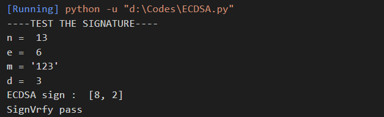
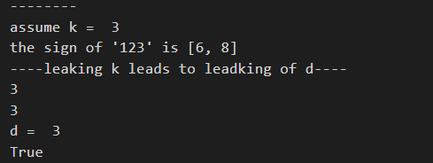
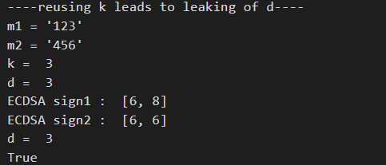
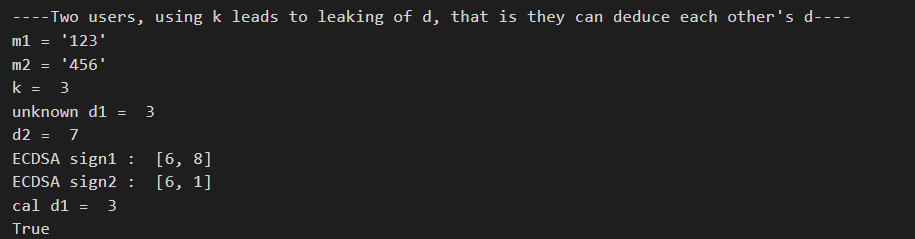
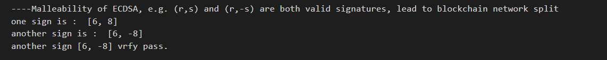

# SM2

项目完成人：郭灿林

|文件|项目|
|-|-|
|ECDSA.py|Project: verify the above pitfalls with proof-of-concept code|
|PGP.py|Project: Implement a PGP scheme with SM2|

## ECDSA的弱点

files : ECDSA.py

Project : verify the above pitfalls with proof-of-concept code

### ECDSA签名算法验证

如图，用私钥$d$签署的签名，能正确通过验证。具体ECDSA实现见`/Projects/Bitcoin/`。



### Leaking $k$ leads to leaking of $d$

根据ECDSA的签名算法，有$s = k^{-1}(e + dr) \pmod{n}$，可推得$d = (sk - e)  r^{-1} \pmod{n}$，若已知$k$，则可以直接得到$d$。

```python
def k2d(k, G, P, n, e, r, s):
    d = ((s * k - e) * inverse(r, n)) % n
    return d
```

运行结果如下：



### Reusing $k$ leads to leaking of $d$

若两次签名$(r_1,s_1)$和$(r_2,s_2)$使用同一个$k$，那么有$r = r_1 = r_2$,$s_1=k^{-1}(e_1+dr),s_2=k^{-1}(e_2+dr)$，即$ks_1=(e_1+dr),ks_2=(e_2+dr)$，两式相除可得$s_1/s_2=(e_1+dr)/(e_2+dr)$，整理可得$s_1e_2/s_2 +s_1dr/s_2 = e_1 + dr, d= (e_1-s_1e_2/s_2)/(s_1r/s_2-r),d = (e_1s_2-s_1e_2)/(s_1r-rs_2)$ 。

```python
def rek2d(k1, k2, G, P, n, e1, e2, r1, s1, r2, s2):
    r = r1
    d = ((e1 * s2 - s1 * e2) * inverse(s1 * r - r * s2, n)) % n
    return d
```

运行结果如下：



### Two users, using $k$ leads to leaking of $d$, that is they can deduce each other’s $d$

若两个用户使用同样的$k$加密签名，那么有$r = r_1 = r_2, s_1k=(e_1+d_1r),s_2k=(e_2+d_1r) $，第一个式子乘$s_2$，第二个式子乘$s_1$，可以得到$s_1s_2k=(s_2e_1+s_2rd_1),s_1s_2k=(s_1e_2+s_1rd_1)$，那么有$s_2rd_1 = s_1e_2+s_1rd_2 - s_2e_1$，由此方程可求得$d_1$。

```python
def same_k_d22d1(k, G, P, n, d2, e1, e2, r1, s1, r2, s2):
    r = r1
    d1 = (inverse(s2 * r, n) * (s1 * e2 - s2 * e1 + s1 * r * d2)) % n
    return d1
```

运行结果如下：



### Malleability of ECDSA, e.g. $(r,s)$ and $(r,-s)$ are both valid signatures, lead to blockchain network split

对于$(r,s)$验签，计算$es^{-1}G+rs^{-1}P=(x',y')$，若$r = x'$则通过验证；对于$(r,-s)$，计算
$e(-s)^{-1}G+r(-s)^{-1}P=-(es^{-1}G+rs^{-1}P)=(x',-y')$，得到的点的横坐标同样是$x'$，可通过验证。
```python
    print("----Malleability of ECDSA, e.g. (r,s) and (r,-s) are both valid signatures, lead to blockchain network split")
    print("one sign is : ", S)
    anotherS = [S[0], -S[1]]
    print("another sign is : ", anotherS)
    if ECDSAVrfy(P, e, n, G, anotherS[0], anotherS[1]) == 1:
        print("another sign {} vrfy pass.".format(anotherS))
```

运行结果如下：



### Ambiguity of DER encode could lead to blockchain network split

查阅bitcoin的源码https://github.com/bitcoin/bips/blob/master/bip-0062.mediawiki，如下，定义了DER编码的具体规则。

```
DER encoding

For reference, here is how to encode signatures correctly in DER format.

0x30 [total-length] 0x02 [R-length] [R] 0x02 [S-length] [S] [sighash-type]

total-length: 1-byte length descriptor of everything that follows, excluding the sighash byte.
R-length: 1-byte length descriptor of the R value that follows.
R: arbitrary-length big-endian encoded R value. It cannot start with any 0x00 bytes, unless the first byte that follows is 0x80 or higher, in which case a single 0x00 is required.
S-length: 1-byte length descriptor of the S value that follows.
S: arbitrary-length big-endian encoded S value. The same rules apply as for R.
sighash-type: 1-byte hashtype flag (only 0x01, 0x02, 0x03, 0x81, 0x82 and 0x83 are allowed).
```

由于bitcoin一直调用的是openssl中的算法，后来openssl更新了DER编码，而有些区块的hash值还是依据没有DER编码计算的，这就导致同一个签名会被编码成不同的二进制串，最后区块得到的hash值不同，从而导致区块链的分裂。

### One can forge signature if the verification does not check $m$

这部分和Project : forge a signature to pretend that you are Satoshi差不多在此不做赘述，可见`/Projects/Bitcoin/`文件夹。

### Same $d$ and $k$, used in ECDSA & Schnorr signature, leads to leaking of $d$

根据ECDSA签名算法有$s_1k=e_1+dr$，Schnorr签名有$s_2=k+e_2d$，联立可得$d = (s_1s_2-e_1)/(s_1e_2+r)$。

```python
def ECDSA_Schnorr(G, P, n, e1, e2, r1, s1, R, s2):
    d = ((s1*s2 - e1) * inverse(s1*e2+r, n)) % n
    return d
```

运行结果如下：


## 使用SM2实现PGP

files : PGP.py

Project : Implement a PGP scheme with SM2

参考资料：https://blog.csdn.net/m0_46743327/article/details/124629798

结果如图，正确对密钥进行协商，并成功加解密信息。


该PGP实现使用gmssl库中的sm2算法，实现了基于SM2的密钥交换和消息加密传输和解密。

首先，用`generate_key`函数生成随机的用于对称加密算法的密钥。

```
def generate_key():
    x = str(random.randint(0, 2 ** 32))
    m = hashlib.md5()
    m.update(x.encode("utf-8"))
    return m.hexdigest()[0 : 16]
```

发送方使用生成的对称密钥对要传输的明文进行SM4算法加密。同时用要进行交流的一方的公钥对对称密钥进行加密，使用非对称加密算法SM2。

```
    crysm4 = CryptSM4()
    crysm4.set_key(key, SM4_ENCRYPT)
    plaintext = 'fixedpoint'
    ciphertext = crysm4.crypt_ecb(plaintext.encode())
    sm2crypt = sm2.CryptSM2(public_key=public_key, private_key=private_key)
    enckey = sm2crypt.encrypt(key)
```

接受方接受到加密的密钥，使用自己的私钥进行解密，得到用于对称密码算法的密钥，然后对密文进行解密。

```
    deckey = sm2crypt.decrypt(enckey)
    crysm42 = CryptSM4()
    crysm42.set_key(deckey, SM4_DECRYPT)
    dectext = crysm42.crypt_ecb(ciphertext)
```
