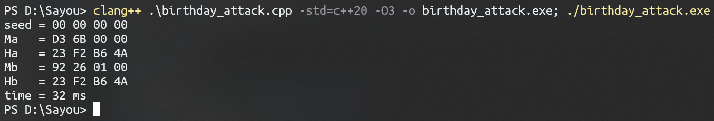
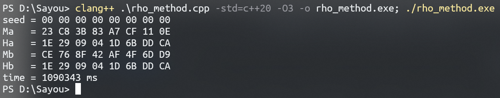
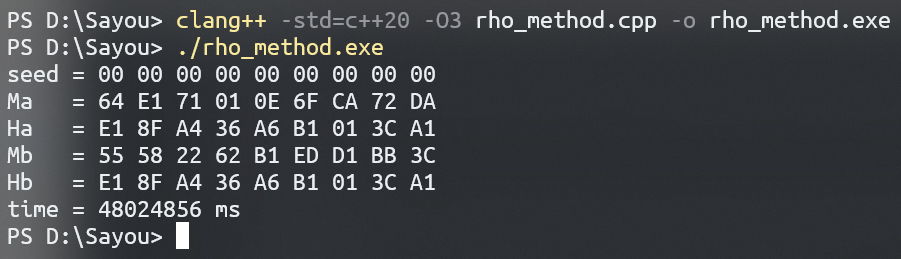
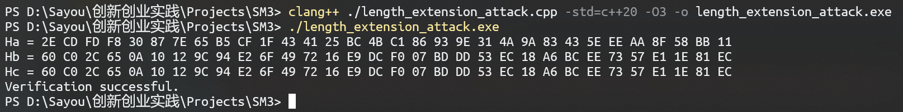

# SM3

贡献者：李岱耕

目录：

- [Birthday Attack](#birthday-attack)

- [Rho Method](#rho-method)

- [Length Extension Attack](#length-extension-attack)

- [SM3 优化](#sm3-optimization)

- [Merkle Tree](#merkle-tree)

## Birthday Attack

### 编译和运行

在此目录下执行以下命令：

```
clang++ birthday_attack.cpp -std=c++2a -o birthday_attack.exe -O3
./birthday_attack.exe
```

*注：修改 birthday_attack.cpp 中 `hash_size` 的值可改变 hash 函数的输出字节数，例如，将 `hash_size` 设置为 `6` 即可测试针对 *48* 位简化 SM3 算法（即只保留原始 SM3 算法输出的前 48 位）的生日攻击。*

### 算法说明

生日攻击所利用的是概率论中生日问题的数学原理。定义一字典 D，其键值表示某一消息的哈希值，内容是原始消息。依次对不同消息计算哈希值，然后判断哈希值在字典中是否已经存在，若存在，则输出当前消息以及字典中的哈希值所对应的消息，否则将该哈希值与消息本身存入字典中，继续计算。该算法的时间复杂度和空间复杂度均为 $O\(2^{\frac{n}{2}}\)$。

### 测试结果

针对 *32* 位简化 SM3 算法的生日攻击，在 O3 优化下单次攻击平均耗时约 30 ms, 最大内存占用量 4.7 MB.



针对 *48* 位简化 SM3 算法的生日攻击，在 O3 优化下单次攻击耗时 12 s, 最大内存占用量 1.3 GB.


针对 *56* 位简化 SM3 算法的生日攻击，在 O3 优化下单次攻击耗时间约 10 min, 最大内存占用量 20.1 GB.


## Rho Method

### 编译和运行

在此目录下执行以下命令：

```
clang++ rho_method.cpp -std=c++2a -o rho_method.exe -O3
./rho_method.exe
```

*注：修改 rho_method.cpp 中 `hash_size` 的值可改变 hash 函数的输出字节数，例如，将 `hash_size` 设置为 `8` 即可测试针对 *64* 位简化 SM3 算法（即只保留原始 SM3 算法输出的前 64 位）的 Rho Method 攻击。*

### 算法说明

*注：该算法对原始 Rho Method 攻击进行了部分修改和优化。*

考虑数列 $\lbrace H_n\rbrace$，其中 $H_0=seed$，$H_{n+1}=hash(H_n)$，易知该数列最终一定会进入一个循环，且数列进入循环前的最后一个值与该循环周期的最后一个值能够发生碰撞。设此循环的周期为 $\rho$，求出该 $\rho$ 的值，然后，令变量 $i$ 和 $j$ 分别从 $H_0$ 和 $H_\rho$ 出发同步迭代，并逐次比较 $i$ 和 $j$ 的值，当判断出二者第一次相等时，即找到了碰撞发生的位置。其中，求 $\rho$ 值可通过如下算法实现：

令变量 $i$ 在数列中迭代：第一轮迭代 $1$ 次得到 $H_1$，将其与 $H_0$ 比较；第二轮迭代 $2$ 次得到 $H_2$ 和 $H_3$，依次与 $H_1$ 比较；第三轮迭代 $4$ 次得到 $H_4$, $H_5$, $H_6$ 和 $H_7$，依次与 $H_3$ 比较……如是重复，每轮迭代 $2^{n-1}$ 次，并依次与上一轮最后一次迭代得到的值比较，直到比较出相同为止，此时 $i$ 在当前轮中迭代的次数即为 $\rho$. 经测试，该算法比原始 Rho Method 通过两个变量一快一慢遍历数列求 $rho$ 值的效率更高，用该算法最终找到一组碰撞的平均总耗时约能达到原算法的 60%.

伪代码如下：

```
func get_rho(seed):
    i = seed
    for n = 1, 2, 4, 8, ...:
        t = i
        for rho = 1 .. n:
            i = hash(i)
            if i == t:
                return rho

func rho_method(seed):
    rho = get_rho(seed)
    x = y = seed
    for i = 1 .. rho:
        y = hash(y)
    while 1:
        if hash(x) == hash(y):
            return x, y
        x = hash(x)
        y = hash(y)       
```

Rho Method 攻击的时间复杂度为 $O\(2^{\frac{n}{2}}\)$，空间复杂度为 $O\(1\)$。

### 测试结果

针对 *32* 位简化 SM3 算法的 Rho Method 攻击，经测试在 O3 优化下单次攻击耗时约 30 ms:


针对 *64* 位简化 SM3 算法的 Rho Method 攻击，在 O3 优化下单次攻击耗时约 18 min:



另外针对 *72* 位简化 SM3 算法也进行了测试并找到一组碰撞，耗时约 11 h.（由于进行该测试时，程序的具体实现和现在略有不同，所以实际编译运行的结果可能与截图中的有出入）



## Length Extension Attack

### 编译和运行

在此目录下执行以下命令：

```
clang++ length_extension_attack.cpp -std=c++2a -o length_extension_attack.exe -O3
./length_extension_attack.exe
```

### 测试内容说明

先通过 SM3 算法计算出信息 `a = "ABCDEFGHIJKLMNOPQRSTUVWXYZABCDEFGHIJKLMNOPQRSTUVWXYZABCDEFGHIJKLMNOPQRSTUVWXYZABCDEFGHIJKLMNOPQRSTUVWXYZ"` 对应的哈希值 `Ha`, 对其进行长度扩展攻击，扩充一段信息 `b = "0123456789"` 并计算出新的哈希值 `Hb`, 然后与直接计算 `c = a || padding || b` 得到的哈希值 `Hc` 进行比较验证。



## SM3 Optimization

### 编译和运行

在此目录下执行以下命令：

```
clang++ sm3_test.cpp -std=c++2a -o sm3_test.exe -O3
./sm3_test.exe test_file
```

### 测试结果

经测试，优化后的算法在 O3 优化下计算 1 GB 文件的哈希值耗时约 3.8 s，使用 GmSSL 中的算法则需要约 10s.


## Merkle Tree

### 项目要求

依据协议 RFC6962 实现 Merkel 树，构造具有 10w 叶节点的 Merkle 树，可以对指定元素构建包含关系的证明，可以对指定元素构建不包含关系的证明。


### 编译和运行

在此目录下执行以下命令：

```
clang++ merkle_tree.cpp -std=c++2a -o merkle_tree.exe -O3
./merkle_tree.exe
```

### 思路

创建 `MerkleTree` 类，通过递归实现其创建和遍历，验证某一元素是否存在时，先通过遍历找到其对应的叶子节点，若未找到则证明不存在，否则依次验证该叶子节点每个父节点是否正确，如果全部正确则证明存在，否则返回异常。

### 测试结果


