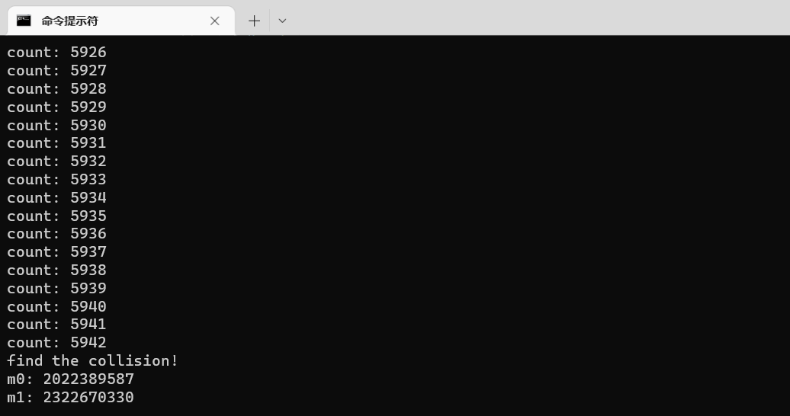
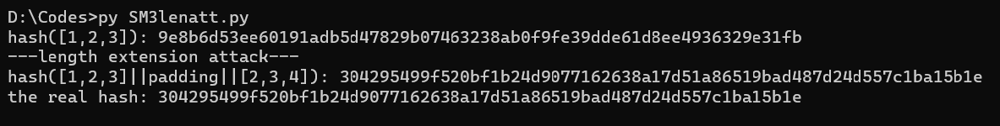

# SM3

项目完成人：郭灿林

该文件夹主要存储SM3相关项目。
|文件名|对应项目|
|-|-|
|SM3biratt.py|Project: implement the naïve birthday attack of reduced SM3|
|SM3lenatt.py|Project: implement length extension attack for SM3|
|SM3bygcl.c|Project: do your best to optimize SM3 implementation (software)|

## SM3生日攻击

files : SM3biratt.py

Project : implement the naïve birthday attack of reduced SM3

根据生日攻击的原理，当计算的hash值超过$2^{n/2}$就有$1/2$的概率找到碰撞，由于SM3的安全强度超过个人计算机的计算量，因此对SM3做了简化，只取计算出来的$DLEN * 4$位(如16位)，取随机数计算hash，测试找到碰撞的概率。其中SM3调用gmssl库中的sm3算法。

如上找到一个碰撞，16位的碰撞，大概用了6000次，在$[2^8,2^{16}]$中。

## SM3长度扩展攻击

files : SM3lenatt.py

Project: implement length extension attack for SM3

